# Project 2 — Site-to-Site IPSec VPN

**Home Lab | Martin Vo | June 2026**

---

## What I Built

A site-to-site IPSec VPN tunnel between a FortiGate 60F at HQ and a Cisco ISR 2921 at a simulated Branch office, connected through a MikroTik router acting as the internet. Once the tunnel is up, a MacBook on the HQ Corporate LAN and a Windows PC on the Branch LAN can communicate as if they were on the same network — traffic travels encrypted across the simulated ISP and neither end device knows the other site exists.

The challenge with this project is that it is a **cross-vendor implementation**. The FortiGate and the Cisco ISR use completely different command structures, different terminology, and different configuration models. For the tunnel to establish, every Phase 1 and Phase 2 parameter — encryption algorithm, hash, DH group, lifetime, and traffic selectors — must match exactly on both sides. A single mismatch and the tunnel silently fails.

<table>
  <tr>
    <td>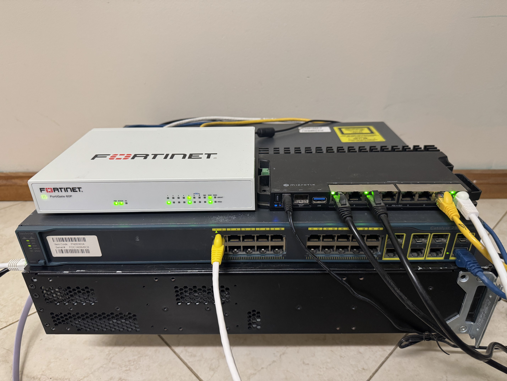</td>
    <td>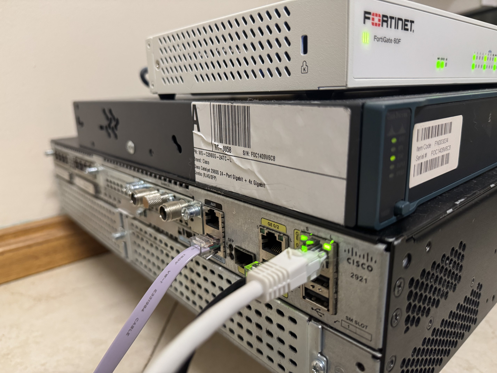</td>
  </tr>
</table>

---

## Why It Matters

Site-to-site VPNs are how enterprise networks connect branch offices, data centres, and partners. In the real world, those connections often run across equipment from different vendors — a Palo Alto at HQ connecting to a Cisco at a branch, or a FortiGate connecting to a cloud VPN gateway. The ability to configure and troubleshoot IPSec across platforms is a core skill for any network security engineer.

This lab replicates that exact scenario. It also produced a genuine troubleshooting problem — a routing conflict inherited from Project 1 that broke internet access for the Branch LAN — which required systematic diagnosis and a deliberate design decision to fix properly.

---

## Lab Hardware

| Device | Model | Role |
|--------|-------|------|
| Firewall | FortiGate 60F (FortiOS 7.2.12) | HQ perimeter NGFW and VPN gateway |
| Switch | Cisco Catalyst 2960G (SW-HQ-LAB) | HQ access switch |
| Simulated ISP | MikroTik RB5009 | Internet simulation between sites |
| Branch router | Cisco ISR 2921 (IOS 15.5(3)M6a UNIVERSALK9) | Branch router and VPN peer |
| HQ test device | MacBook Pro | 172.16.10.100 — HQ Corporate LAN |
| Branch test device | Windows PC | 172.16.30.11 — Branch LAN |

---

## Topology

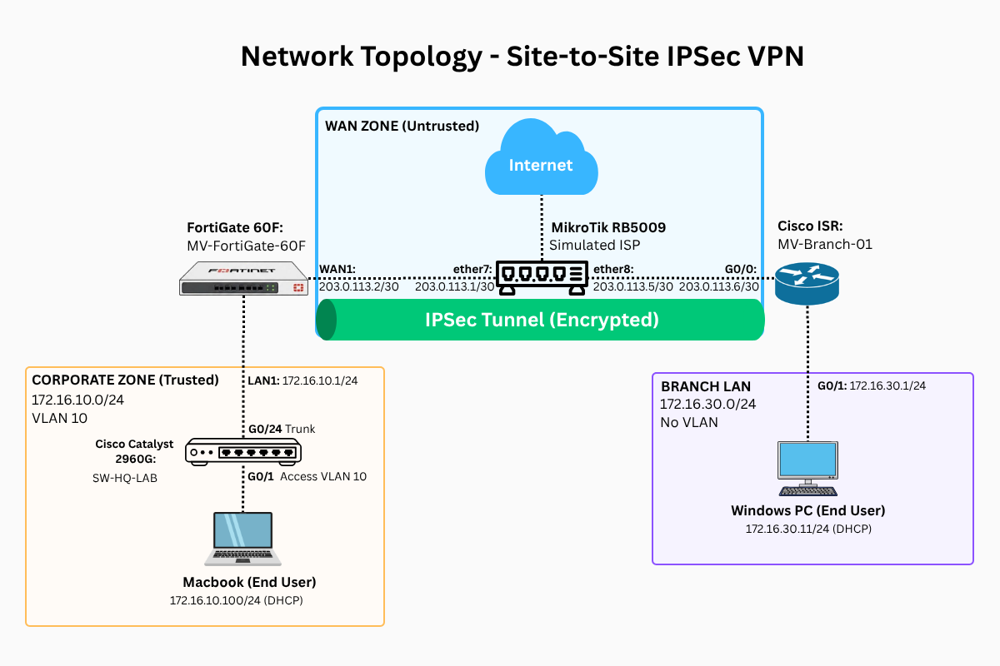

> **Design note:** The MikroTik RB5009 acts as a simulated ISP — both VPN peers communicate through it as if traversing the public internet, with no direct Layer 2 adjacency between the FortiGate and Cisco ISR.
---

## IP Addressing

| Device | Interface | IP Address | Purpose |
|--------|-----------|------------|---------|
| MikroTik | ether7 | 203.0.113.1/30 | WAN link to FortiGate |
| FortiGate | WAN1 | 203.0.113.2/30 | HQ WAN interface |
| MikroTik | ether8 | 203.0.113.5/30 | WAN link to Cisco ISR |
| Cisco ISR 2921 | GigabitEthernet0/0 | 203.0.113.6/30 | Branch WAN interface |
| FortiGate | VLAN10_Internal | 172.16.10.1/24 | HQ Corporate LAN gateway |
| Cisco ISR 2921 | GigabitEthernet0/1 | 172.16.30.1/24 | Branch LAN gateway |
| MacBook Pro | - | 172.16.10.100/24 | Corporate test device (DHCP) |
| Cisco ISR 2921 | - | 172.16.30.11/24 | Branch test device (DHCP) |

---

## IPSec Overview — How This Tunnel Works

Before getting into configuration it helps to understand what IPSec is actually doing, because it shapes every decision made in this project.

An IPSec VPN between two sites negotiates in two stages:

**Phase 1** establishes a secure, encrypted management channel between the two peers — called the ISAKMP SA. This is used only for negotiation. Both devices prove they are who they say they are (using a pre-shared key), agree on encryption and hashing algorithms, and generate shared keys using Diffie-Hellman.

**Phase 2** uses that secure channel to negotiate the actual data tunnel — called the IPSec SA. This defines how the real traffic between the two LANs gets encrypted. Phase 2 also defines *what* traffic goes into the tunnel (the traffic selectors), which must match exactly on both sides.

**Why IKEv1 instead of IKEv2:** IKEv1 was chosen for cross-vendor compatibility. Both Cisco IOS and FortiOS have full IKEv1 support with well-documented behaviour across versions. IKEv2 is faster and has built-in NAT traversal, but IKEv1's two-phase model also maps directly to how IPSec is taught — understanding it builds the conceptual foundation before moving to IKEv2.

---

## How I Built It

The build followed a deliberate sequence: get the Cisco ISR up and routing first, verify Layer 3 reachability between the two VPN peers, then configure IPSec on the Cisco side, then mirror it on the FortiGate. Testing only happened after both sides were fully configured.

---

### Step 1 — Cisco ISR 2921: Initial Setup

The ISR was new to the lab for this project. I powered it on, connected via console cable, and skipped the initial config dialog.

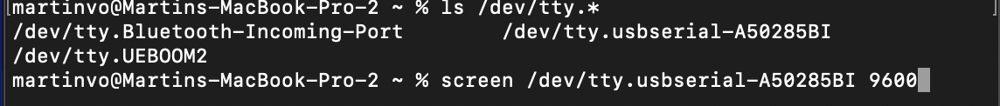


**First step: verify the IOS image supports crypto.** This matters — IOS images without the K9 (cryptography) licence will accept IPSec commands but silently fail to establish tunnels, leaving nothing in the logs to diagnose.


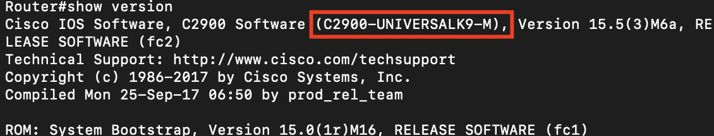

The output confirmed everything needed:
- `C2900-UNIVERSALK9-M` — universal image with full cryptography support
- `1 Virtual Private Network (VPN) Module` — hardware VPN acceleration present
- `Version 15.5(3)M6a` — stable IOS with full IKEv1 and IKEv2 support

With crypto confirmed, basic setup:

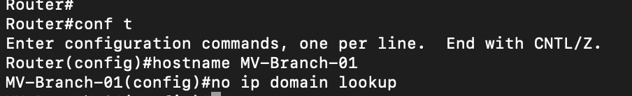

`no ip domain-lookup` stops the router from trying to resolve mistyped commands as DNS queries — without it a typo in exec mode causes a 30-second hang.

**Checked available interfaces before configuring:**

```
show ip interface brief
```

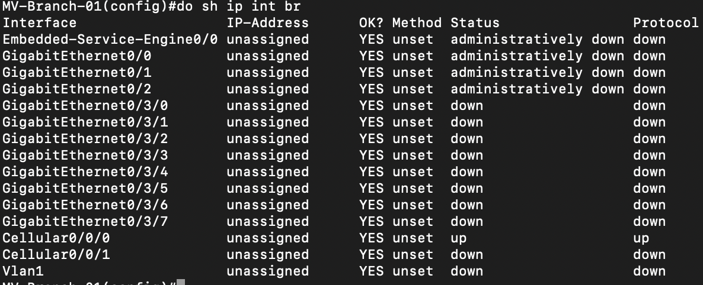

**Configured the WAN interface:**

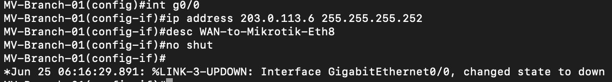

**Configured the LAN interface:**

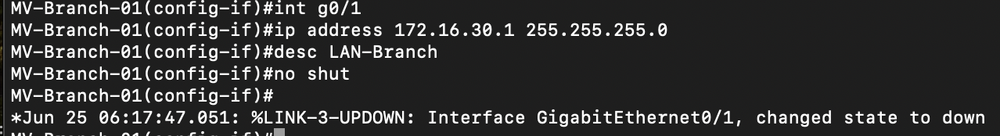

**Verified both interfaces are up:**

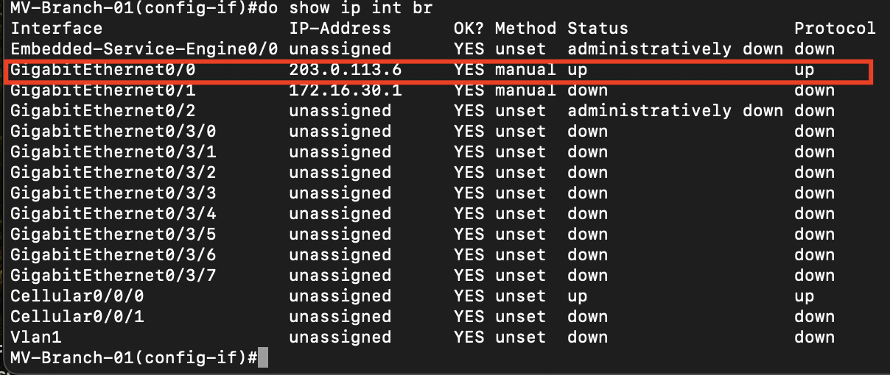

**Added a default route** pointing to the MikroTik as the gateway of last resort:

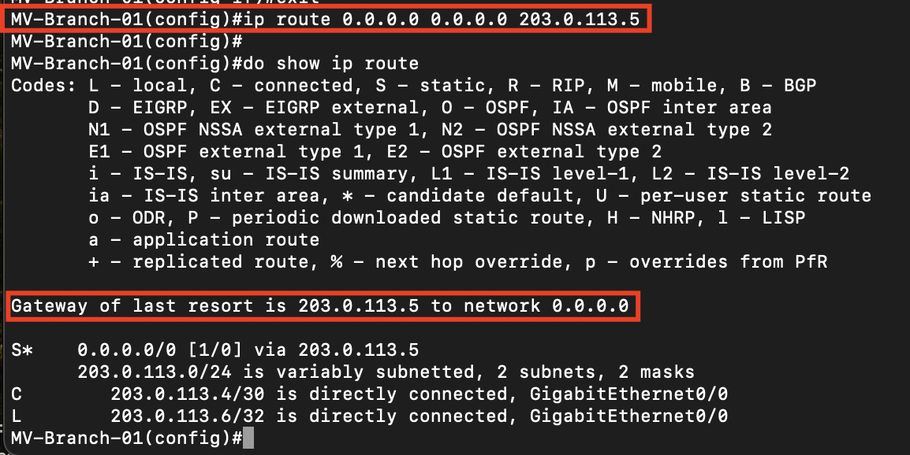

**Verified Layer 3 reachability to both the MikroTik and the FortiGate before touching any IPSec config:**

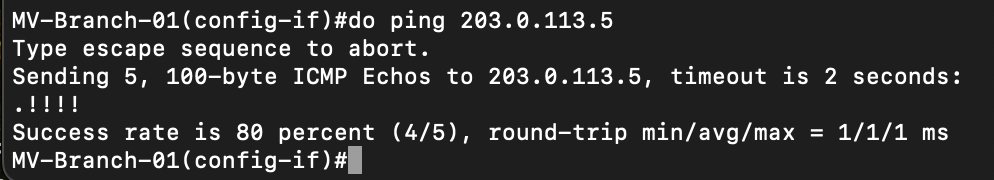

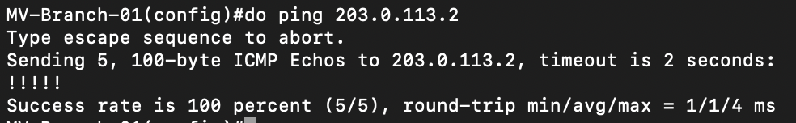

Both peers reachable end-to-end through the simulated ISP. The first ping to MikroTik was 4/5 — expected, the router needs one ARP before it can send ICMP.

This step is non-negotiable. No amount of correct IPSec configuration will establish a tunnel if the peers cannot reach each other at Layer 3.

---

### Step 2 — Cisco ISR 2921: IPSec Configuration

With the ISR up and routing, the IPSec stack gets built in a specific order: Phase 1 policy → pre-shared key → Phase 2 transform set → interesting traffic ACL → crypto map → apply to interface. Each piece builds on the last.

#### Phase 1 — IKE Policy

```
crypto isakmp policy 10
 encryption aes 256
 hash sha256
 authentication pre-share
 group 14
 lifetime 86400
```

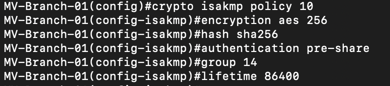

This creates the Phase 1 negotiation parameters. When the ISR initiates a tunnel it presents this policy to the FortiGate — if the FortiGate has a matching policy, Phase 1 proceeds.

| Parameter | Value | Why |
|-----------|-------|-----|
| `encr aes 256` | AES-256 | Industry standard. Must match FortiGate exactly |
| `hash sha256` | SHA-256 | Integrity check on IKE messages. More secure than SHA-1 |
| `authentication pre-share` | Pre-shared key | Simpler than PKI for a lab. Both sides share the same secret |
| `group 14` | DH Group 14 (2048-bit) | Key exchange algorithm. Group 14 is the current minimum recommended |
| `lifetime 86400` | 24 hours | How long Phase 1 SA stays valid before renegotiating |

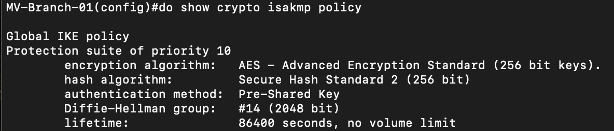

#### Pre-Shared Key

```
crypto isakmp key <pre-shared-key> address 203.0.113.2
```

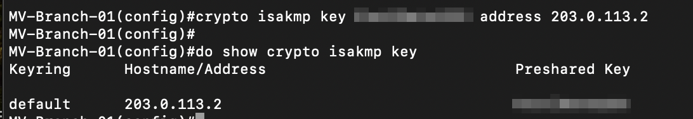

The key is tied to the FortiGate peer IP. It is case-sensitive and must be identical on both sides — a mismatch causes Phase 1 to fail at the authentication stage with minimal output to debug from.

#### Phase 2 — Transform Set

Phase 2 defines how the actual data traffic gets encrypted. The transform set sets those parameters.

```
crypto ipsec transform-set TS-FORTIGATE esp-aes 256 esp-sha256-hmac
 mode tunnel
```

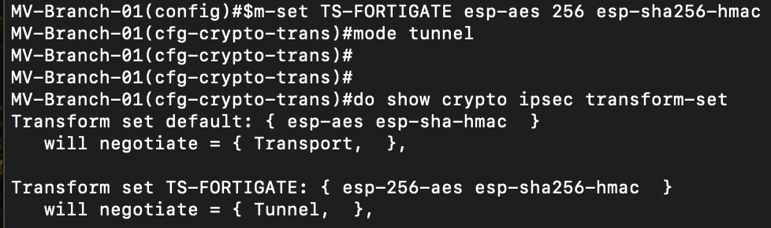

- `esp-aes 256` — ESP with AES-256. ESP chosen over AH because it provides both encryption and authentication; AH provides authentication only.
- `esp-sha256-hmac` — SHA-256 integrity check on each encrypted packet.
- `mode tunnel` — the entire original IP packet including headers gets encrypted and wrapped in a new packet. Used for site-to-site. Transport mode (payload only) is for host-to-host.

#### Interesting Traffic ACL

This defines which traffic gets encrypted and sent into the tunnel — anything that doesn't match gets routed normally.

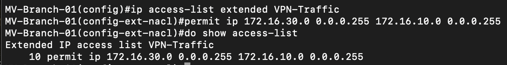

From the Cisco ISR's perspective: source is the Branch LAN (172.16.30.0/24), destination is the HQ Corporate LAN (172.16.10.0/24). The FortiGate will define these in reverse — local 172.16.10.0/24, remote 172.16.30.0/24. They must be exact mirror images.

A mismatch here is the most common failure mode in cross-vendor VPN work: Phase 1 succeeds, the tunnel appears to be up, but zero traffic passes.

#### Crypto Map

The crypto map ties all the pieces together — peer IP, transform set, and interesting traffic ACL — and is what actually enforces IPSec on the interface.

```
crypto map CM-FORTIGATE 10 ipsec-isakmp
 set peer 203.0.113.2
 set transform-set TS-FORTIGATE
 match address VPN-Traffic
 set pfs group14
```

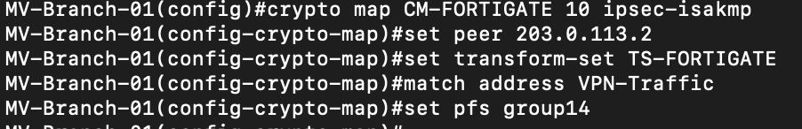

`set pfs group14` enables Perfect Forward Secrecy — a new DH key exchange runs for every Phase 2 renegotiation, so a compromised session key cannot decrypt past or future sessions.

#### Apply Crypto Map to the WAN Interface

```
interface GigabitEthernet0/0
 crypto map CM-FORTIGATE
```

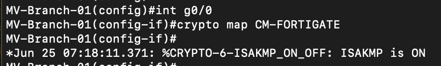

This activates IPSec on the WAN interface. From this point the ISR monitors all outbound traffic on G0/0, compares it against the interesting traffic ACL, and encrypts anything that matches before sending it toward the FortiGate.

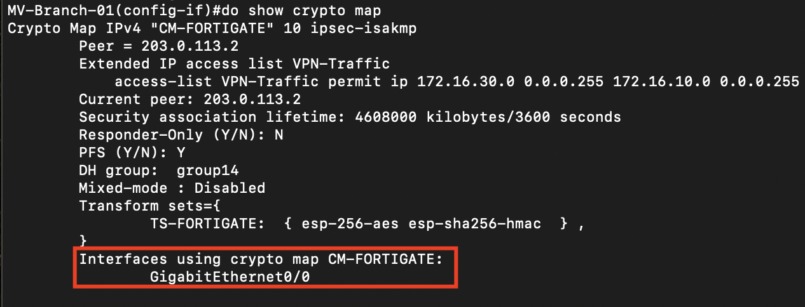

The Cisco ISR side is now fully configured.

---

### Step 3 — FortiGate: IPSec Configuration

With the Cisco side done, the FortiGate gets configured to mirror it. Navigate to **VPN → IPSec Tunnels → Create New → IPSec Tunnel**.

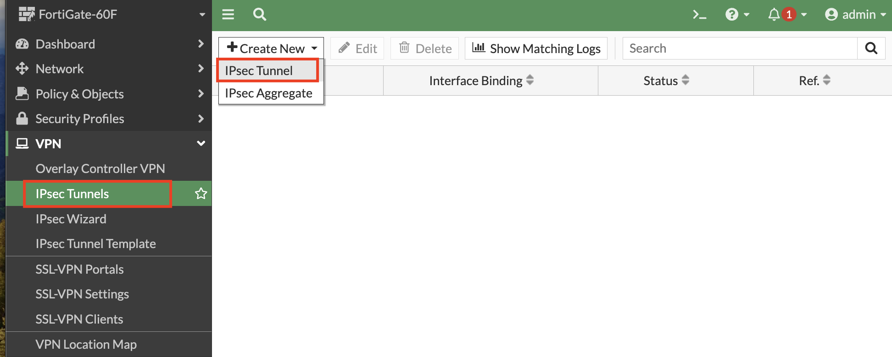

Template type: **Custom**

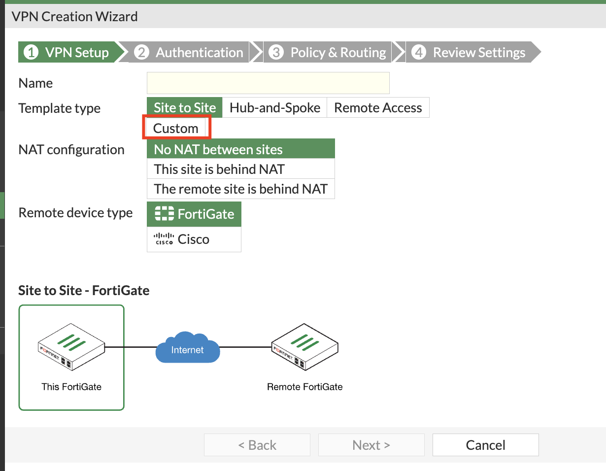

The wizard was not used. The built-in Site-to-Site wizard makes assumptions about defaults that may not align with the specific parameters configured on the Cisco — in a cross-vendor deployment, explicit beats assumed.

Tunnel name: **VPN-Cisco-2921**

**Network settings:**

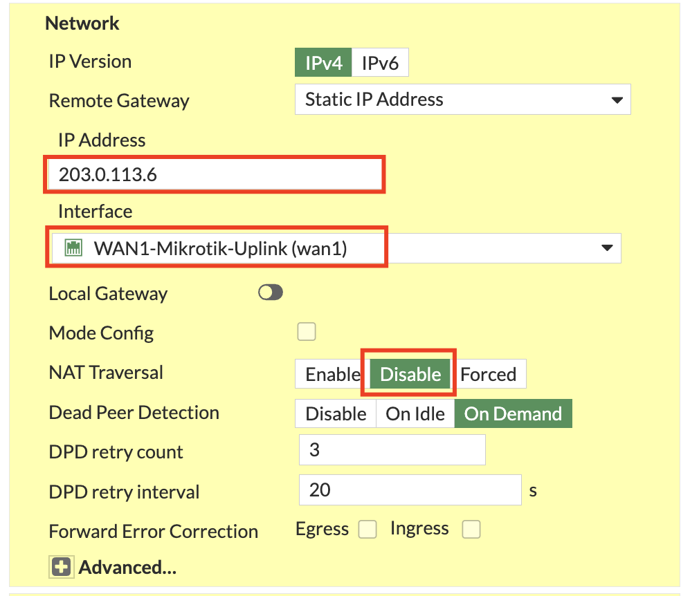

| Field | Value | Why |
|-------|-------|-----|
| Remote Gateway | Static IP Address | Both peers have fixed IPs |
| IP Address | 203.0.113.6 | Cisco ISR WAN IP |
| Interface | WAN1 | FortiGate WAN facing MikroTik |
| NAT Traversal | Disabled | MikroTik is not NATting the peer addresses |
| Dead Peer Detection | On Demand | Clears stuck tunnels automatically after 3 failed keepalives |

**Authentication:**

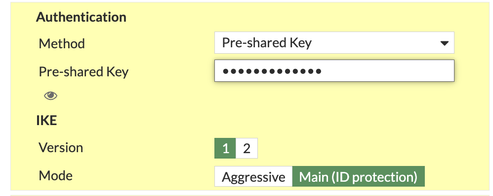

| Field | Value | Why |
|-------|-------|-----|
| Method | Pre-shared Key | Matches Cisco ISR |
| Pre-shared Key | FortiGate123! | Must be identical — case sensitive |
| IKE Version | 1 | Must match Cisco. Mixing versions = Phase 1 failure |
| Mode | Main | 6-message exchange, peer identity stays protected |

**Phase 1 Proposal** — must match the Cisco `crypto isakmp policy 10` exactly:

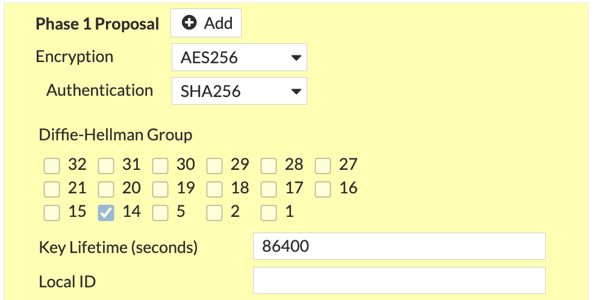

| Parameter | Value |
|-----------|-------|
| Encryption | AES256 |
| Authentication | SHA256 |
| DH Group | 14 only (all others deselected) |
| Key Lifetime | 86400 seconds |

**Phase 2 Proposal** — must match the Cisco transform set exactly:

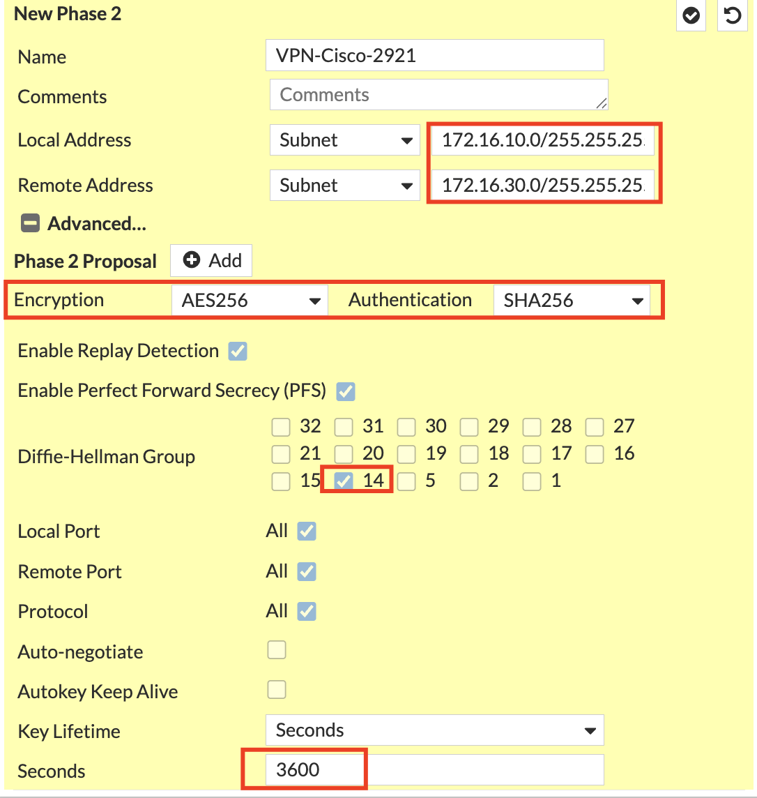

| Parameter | Value |
|-----------|-------|
| Encryption | AES256 |
| Authentication | SHA256 |
| PFS | Enabled, DH Group 14 |
| Key Lifetime | 3600 seconds |

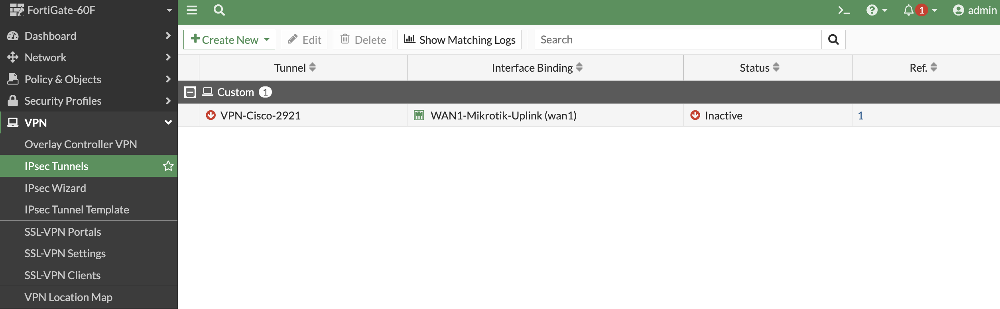

---

### Step 4 — FortiGate: Static Route and Firewall Policies

The VPN tunnel exists, but the FortiGate still needs two more things: a route to tell it where the Branch LAN is, and firewall policies to permit the traffic.

#### Static Route

Navigate to **Network → Static Routes → Create New**:

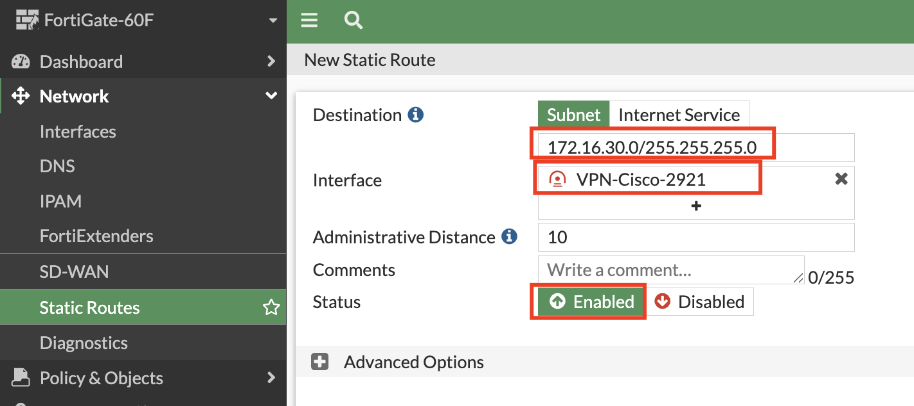

| Field | Value |
|-------|-------|
| Destination | 172.16.30.0/255.255.255.0 |
| Interface | VPN-Cisco-2921 |
| Administrative Distance | 10 |

When a VPN tunnel interface is the outgoing interface, the gateway field disappears — the tunnel handles encapsulation directly without needing a next hop IP. Without this route, the FortiGate has no knowledge of the Branch LAN and traffic heading there either gets dropped or sent unencrypted out WAN1.

#### Firewall Policies

Before creating policies, a view of the existing policy table to understand the current state:

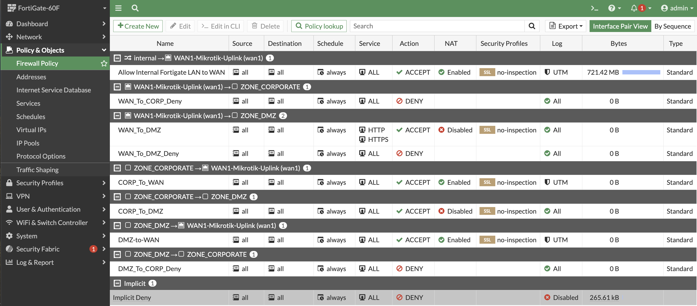

**Address Object — VPN Branch LAN:**

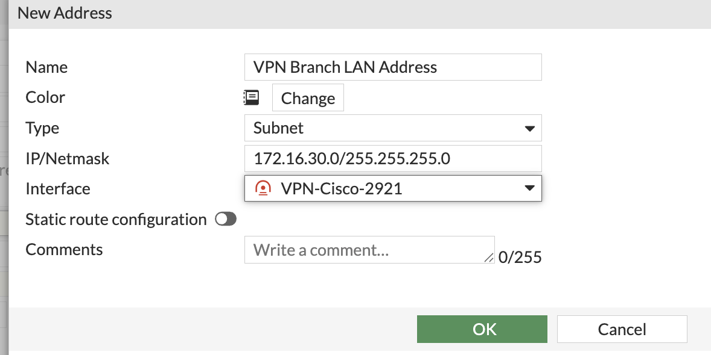

Named objects make policies readable — if the Branch LAN subnet changes, it updates in one place.

**Policy 1 — CORP-to-VPN-BRANCH:**

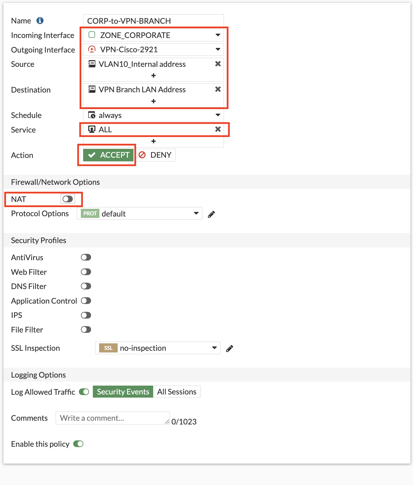

| Field | Value |
|-------|-------|
| Incoming Interface | ZONE_CORPORATE |
| Outgoing Interface | VPN-Cisco-2921 |
| Source | Corporate LAN address object |
| Destination | VPN Branch LAN Address |
| Action | ACCEPT |
| **NAT** | **Disabled** |

**NAT must be off.** If NAT were enabled, the FortiGate would rewrite the source IP of Corporate LAN traffic to its own WAN IP before encrypting it. The Cisco ISR would receive a packet with source 203.0.113.2 — which doesn't match the interesting traffic ACL — and drop it.

**Policy 2 — VPN-BRANCH-to-CORP:**

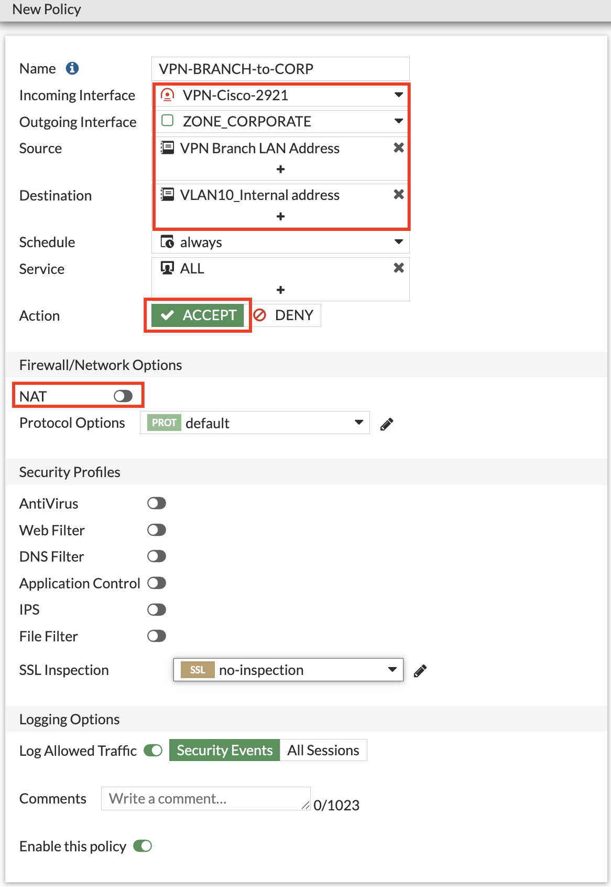

| Field | Value |
|-------|-------|
| Incoming Interface | VPN-Cisco-2921 |
| Outgoing Interface | ZONE_CORPORATE |
| Source | VPN Branch LAN Address |
| Destination | Corporate LAN address object |
| Action | ACCEPT |
| **NAT** | **Disabled** |

Both directions need an explicit policy. The FortiGate processes policy directionally — without this second policy, anything the Branch initiates hits the default deny.

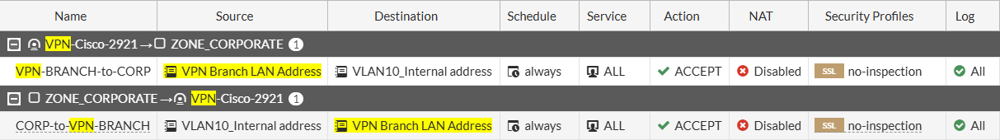

Both sides are now fully configured.

---

### Step 5 — DHCP on Cisco ISR and a Routing Problem

Before testing the VPN tunnel, the Windows PC needed an IP address on the Branch LAN. A DHCP server was configured on the ISR:

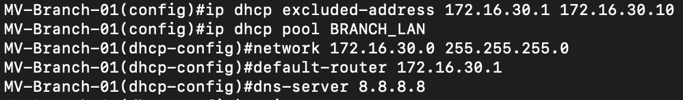

The Windows PC picked up 172.16.30.11 — DHCP working. Then I tested internet access from the Windows PC by pinging 8.8.8.8.

**It failed.**

#### Troubleshooting — Branch LAN Cannot Reach the Internet

Systematic approach, layer by layer:

**Step 1 — Can the PC reach its gateway?**
Pinged 172.16.30.1 from the Windows PC — success. Local connectivity is fine.

**Step 2 — Can the ISR itself reach the internet?**
Pinged 8.8.8.8 from the ISR — success. The ISR has internet access via its default route.

**Step 3 — So the problem is the return path.**
The outbound path works fine. When 8.8.8.8 tries to reply to 172.16.30.11, the packet arrives at MikroTik and MikroTik has to decide where to send it. That's where it breaks.

**Step 4 — Root cause: a routing conflict inherited from Project 1.**

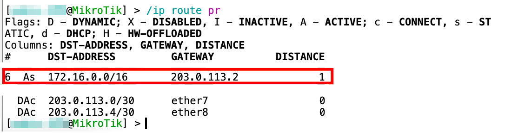

The MikroTik routing table had a summary route from Project 1: `172.16.0.0/16 → 203.0.113.2 (FortiGate)`. The Branch LAN (172.16.30.0/24) falls inside this range — so MikroTik was sending Branch LAN return traffic to the FortiGate instead of the Cisco ISR.

#### Design Decision — How to Fix It

Two options:

**Option A — Add a more specific /24 route for Branch LAN**
Works technically via longest prefix match — but patches over a design problem rather than fixing it.

**Option B — Remove the summary route and add three explicit /24 routes**
Remove the /16 entirely and replace it with specific routes pointing to the correct next hop for each subnet.

Option B was chosen. Specific routes are unambiguous — anyone reading the routing table immediately understands the topology. No reliance on prefix length to resolve a conflict that shouldn't exist.

```
/ip route remove numbers=6

/ip route add dst-address=172.16.10.0/24 gateway=203.0.113.2
/ip route add dst-address=172.16.20.0/24 gateway=203.0.113.2
/ip route add dst-address=172.16.30.0/24 gateway=203.0.113.6
```

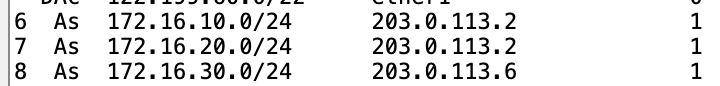

| Destination | Next Hop | |
|-------------|----------|-|
| 172.16.10.0/24 | 203.0.113.2 | HQ Corporate LAN → FortiGate |
| 172.16.20.0/24 | 203.0.113.2 | HQ DMZ → FortiGate |
| 172.16.30.0/24 | 203.0.113.6 | Branch LAN → Cisco ISR |

Windows PC pinged 8.8.8.8 successfully — internet access restored. Ready to test the tunnel.

---

### Step 6 — Testing the VPN Tunnel

Both devices in position:
- **MacBook** on HQ Corporate LAN — 172.16.10.100
- **Windows PC** on Branch LAN — 172.16.30.11

#### Pre-Tunnel State

Before triggering any traffic, the state of the tunnel and SAs was captured to establish a baseline.

FortiGate showed the tunnel as **Inactive** — IKEv1 doesn't pre-establish, it negotiates on-demand when interesting traffic appears.

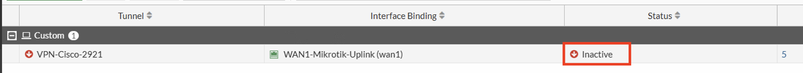

Wireshark was started with an ICMP display filter on the MacBook before the ping was run, ready to capture what happens when the tunnel negotiates.

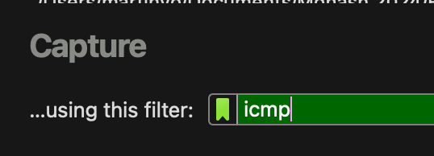

The Cisco ISR showed no established SAs — zero packet counters, no active Security Associations.

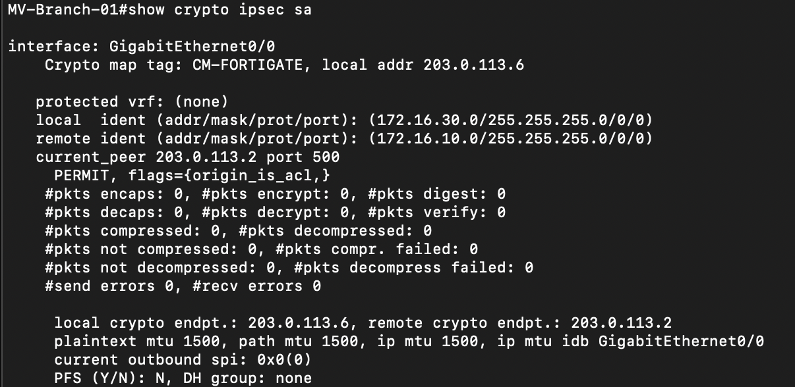

#### Triggering the Tunnel

Triggered the tunnel by pinging the Windows PC from the MacBook:

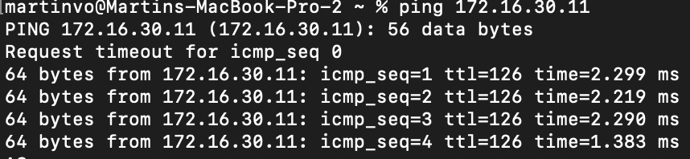

**Timeout on packet 0** — expected. The first ping triggers Phase 1 and Phase 2 negotiation; the packet that triggered it gets dropped during the process. Packets 1-4 all succeed once the tunnel is up.

**TTL of 126** — the MacBook sends with TTL 128. Two router hops (FortiGate + ISR) decrement it to 126, confirming traffic is traversing exactly the expected path.

#### Wireshark Capture

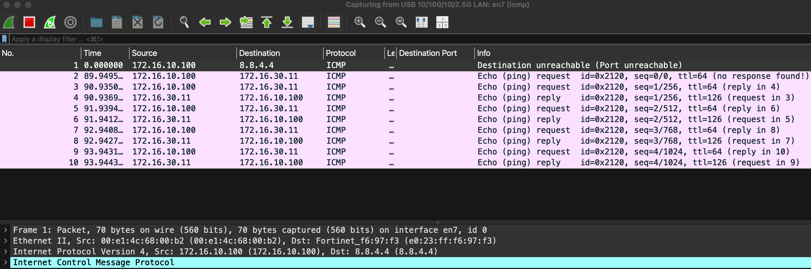

```
Frame 2:  172.16.10.100 → 172.16.30.11  ICMP request  (no reply — tunnel negotiating)
Frame 3:  172.16.10.100 → 172.16.30.11  ICMP request  (reply in 4)
Frame 4:  172.16.30.11  → 172.16.10.100 ICMP reply    (request in 3)
...
```

Every request from Frame 3 onwards has a matched reply — bidirectional traffic confirmed.

Notice there are no WAN IPs in this capture. From the MacBook's perspective traffic goes to 172.16.30.11 and replies come back from 172.16.30.11. The encryption happens transparently at the FortiGate — this is correct VPN behaviour.

#### Phase 1 Verification — Cisco ISR

```
show crypto isakmp sa
```

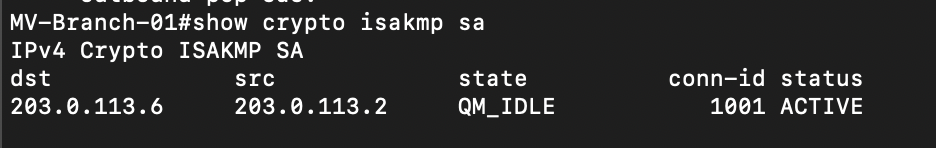

**QM_IDLE** = Quick Mode Idle. Phase 1 is fully established, waiting for Phase 2 traffic. This is the correct state — it does not mean inactive.

#### Phase 2 Verification — Cisco ISR

```
show crypto ipsec sa
```
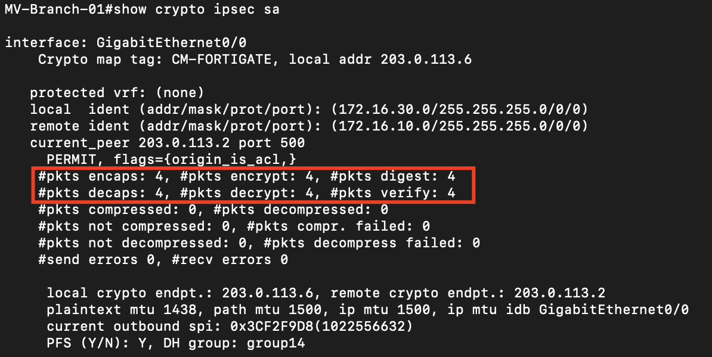

The packet counters tell the whole story:
- **4 encaps / 4 encrypt** — 4 packets encrypted and sent outbound (ping replies from the Windows PC)
- **4 decaps / 4 decrypt** — 4 packets received and decrypted (ping requests from the MacBook)
- **0 errors** — clean tunnel

`plaintext mtu 1438 vs path mtu 1500` — IPSec tunnel mode adds 62 bytes of overhead per packet (ESP header, IV, padding, auth data). Normal.

These counters are the definitive proof the tunnel is actually encrypting and decrypting traffic — not just routing around it.

#### FortiGate Confirmation

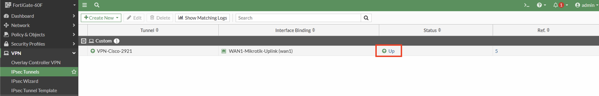

Tunnel status changed from Inactive to **Up** (green).

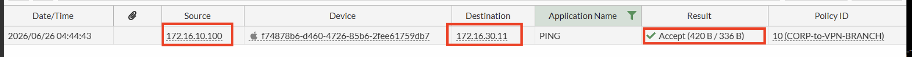

Forward Traffic log shows source 172.16.10.100, destination 172.16.30.11, policy CORP-to-VPN-BRANCH, action ACCEPT, NAT not applied.

---

## Verification Summary

| Test | Result |
|------|--------|
| Ping MacBook → Windows PC | ✓ 4 packets, ~2ms RTT |
| Wireshark — bidirectional ICMP | ✓ Request/reply pairs confirmed |
| FortiGate tunnel status | ✓ Up (green) |
| FortiGate Forward Traffic log | ✓ CORP-to-VPN-BRANCH — ACCEPT, NAT off |
| show crypto isakmp sa | ✓ QM_IDLE ACTIVE |
| show crypto ipsec sa | ✓ 4 encaps, 4 decaps, 0 errors |
| ESP transform | ✓ esp-256-aes esp-sha256-hmac, Tunnel mode |
| PFS | ✓ Group 14 active |

---

## What I Learned

**Verify Layer 3 before touching IPSec.** If the two peers can't reach each other, no amount of correct crypto configuration will help. Ping between peers first — every time.

**Parameter tables are your best friend in cross-vendor work.** Every Phase 1 and Phase 2 parameter must match exactly. Documenting each setting side by side (Cisco vs FortiGate) before starting configuration makes mismatches obvious before they cause failures.

**Phase 1 up does not mean traffic is flowing.** A tunnel in QM_IDLE ACTIVE with zero packet counters is a Phase 2 selector mismatch — a completely different problem from a Phase 1 failure. The packet counters in `show crypto ipsec sa` are the first thing to check when a "working" tunnel isn't passing traffic.

**First packet timeout is normal.** IKEv1 negotiates on-demand. The packet that triggers the tunnel gets dropped during negotiation. In a production troubleshooting scenario this looks like an intermittent failure — it isn't.

**Summary routes have consequences as the network grows.** The routing conflict in this project came from a /16 summary route that made sense for two subnets in Project 1 but broke things the moment a third subnet appeared. Explicit /24 routes per site is cleaner design — the routing table is self-documenting and there's no ambiguity about which next hop a subnet uses.

**NAT and VPN selectors are mutually exclusive.** NAT rewrites source IPs. VPN selectors match on original source IPs. If NAT fires before the crypto map checks, the interesting traffic ACL never matches and the tunnel drops the traffic. Always disable NAT on VPN policies.

---

## Key Takeaways for Production

- Always verify peer reachability at Layer 3 before configuring IPSec
- In cross-vendor deployments, use custom configuration mode — never the wizard
- Document Phase 1 and Phase 2 parameters side by side before configuring either device
- Disable NAT on VPN firewall policies
- Restrict DH group to a single value — leaving multiple selected risks negotiating a weaker group
- Use specific /24 routes per site rather than summary routes in multi-site designs
- `show crypto ipsec sa` packet counters are the definitive verification — zero counters on an active tunnel is a traffic selector problem, not a tunnel problem
- Enable PFS — cost is negligible, security benefit is meaningful

---

## Technologies Used

- **Fortinet FortiGate 60F** — HQ NGFW, IPSec Phase 1 and Phase 2, firewall policies, static routing
- **Cisco ISR 2921** — Branch router, IKEv1, crypto map, transform set, DHCP
- **MikroTik RB5009** — Simulated ISP, corrected multi-site routing
- **Cisco IOS 15.5(3)M6a UNIVERSALK9** — Cryptography and hardware VPN acceleration
- **Wireshark** — Packet capture and verification

---

## Repository Structure

```
project-2-ipsec-vpn/
├── README.md
├── project-2-topology-diagram.png
├── lab-photo-front.jpg
├── lab-photo-cisco-isr.jpg
├── screenshots/
│   ├── 01-initial-setup/
│   ├── 02-cisco-ipsec/
│   ├── 03-fortigate-ipsec/
│   ├── 04-fortigate-static-route/
│   ├── 05-firewall-policies/
│   ├── 06-dhcp-troubleshooting/
│   ├── 07-pre-tunnel/
│   ├── 08-verification/
```

---

*Next project: Project 3 — Python Network Automation with Netmiko https://github.com/martinvok/project-3-netmiko-automation*
